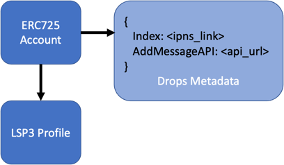
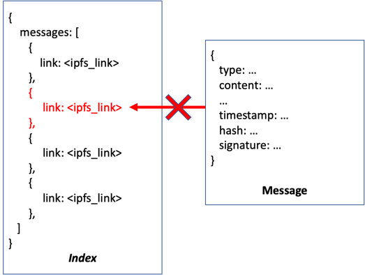
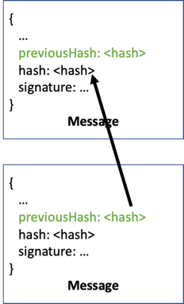
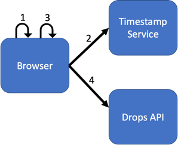
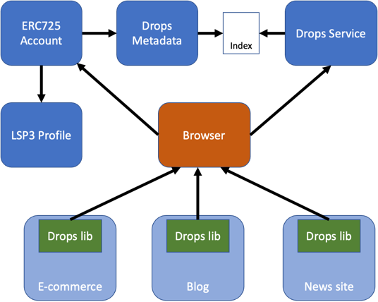

# Drops

Drops is a decentralized social platform and messaging protocol build on top of [Universal Profiles](https://docs.lukso.tech/standards/universal-profile/introduction/).

It offers a gas-less login-less (yet secure) user experience, prioritizing privacy and ease of use.
The protocol empowers users with control over their data while fostering a seamless and interactive environment for social engagement.

To engage with Drops, all that's required is a Web3 wallet, serving as the key to a realm where each message is not only transmitted but also signed, ensuring an unequivocal verification of the sender's identity. 

One of Drops' standout features lies in its gas-less and login-less design. By eliminating the need for transaction fees (gas) and cumbersome login processes, Drops streamlines the user experience. This commitment to simplicity, however, doesn't compromise security.
In fact, Drops introduces measures to prevent any malicious attempts by users to alter their personal indices or manipulate previously sent messages, ensuring the integrity of the platform.

The heart of Drops' architecture lies in its distributed indexing system. Each user's messages are organized within their own distributed index, attached to the users' Universal Profiles.
This innovative approach means that users can effortlessly retrieve and share their messages, fostering a user-centric approach to data management. Each user can decide how they manage their messages and index, whether using an external storage service, a shared (or your own) IPFS node, or the blockchain itself.
In the spirit of decentralization, these distributed indices collectively form an open and transparent network where anyone can explore and verify the interactions within the Drops ecosystem.
Its distributed architecture overcomes censorship hurdles as it ensures that messages are not susceptible to centralized control, providing users with a robust tool to freely express themselves in regions where traditional social media may face restrictions.
This approach introduces a level of trust and authenticity, reshaping the dynamics of online communication.

Drops doesn't just represent a platform. It defines a protocol and provides the tools required to engage with social media and messaging in any other site.
Any other website, such as blogs, forums or news aggregators can integrate Drops into their site, allowing any user to send and view Drops messages attached to a particular scope.


## Main benefits

**Decentralization**: Drops operates on a decentralized model in alignment with the principles of Web3.

**User-centric**: The platform and protocol empowers users with greater control over their data and interactions.

**Gas-less**: The platform eliminates transaction fees (gas), making user engagement cost-free while maintaining the security of transactions.

**Censorship resistance**: Its decentralized and distributed architecture prevents centralized platform from imposing restrictions on users' content and expressions.

**Integrity**: Signatures, in conjunction with other security measures, are in place to impede users from tampering with their personal indices or manipulating sent messages.


## How it works

Similar to how we have the [Profile Metadata (LSP3)](https://docs.lukso.tech/standards/universal-profile/lsp3-profile-metadata) linked to an [ERC725 account](https://docs.lukso.tech/standards/universal-profile/lsp0-erc725account), we can link the Drops metadata.
The Drops metadata is mainly composed of the URL of the _index_ listing and pointing our past messages and interactions, and a URL of the _API_ where to send new messages.

When onboarding into Drops, a new index is generated and linked to the user's account such that any service or users know where to find the messages sent by the given user.



Drops Metadata is defined using the following [ERC725 JSON Schema (LSP2)](https://docs.lukso.tech/standards/generic-standards/lsp2-json-schema/)
```json
{
  "name": "DropsMessageIndex",
  "key": "0x4c4262e7f2aff92ddcb621a0627b0761b019bb5c490c0fd6c044f3ec315928a2",
  "keyType": "Singleton",
  "valueType": "bytes",
  "valueContent": "JSONURL"
}
```

For example, the JSONURL attached to a user's account would look like this:

https://drops-ipfs.us.to/ipfs/QmeebZ6E7aKXjP5NZY7Lbr1Mz5JxAXaa8WggwV5wD5cX58

and the content would look like this:
```json
{
  "index": "https://drops-ipfs.us.to/ipns/k51qzi5uqu5dkflgyfxsm0y06u3ism5zo47i8hjglxsc8awgx80mh16daz37yv",
  "addMessageAPI": "https://drops-m.vercel.app/api/add-message"
}
```

Note that the index URL is directed towards an IPNS (InterPlanetary Name System) record.
This allows us to maintain the profile always linked to the latest version of the index, even as new messages need to be included.
Although IPFS (InterPlanetary File System) is used to store the index in a decentralized manner, where the "files" are immutable, the IPNS record acts as a dynamic pointer.
By leveraging IPNS, we ensure that the profile seamlessly reflects the most recent version of the index without the need to update metadata with every interaction, enhancing efficiency and streamlining the updating process for new messages.

When a new message arrives, Drops stores the new message in IPFS and updates the index on behalf of the user.

It is worth mentioning, using IPNS/IPFS to keep the index is the recommended way to keep messages and index, but Drops do not enforce to use it.
Drops allows any other storage system to keep user's messages. Other index management implementation just need to make sure to follow the
protocol implementation, by providing the aforementioned metadata linked to the profile and follow the messages and index structure.

### Data Types

#### Index

This is the data kept in the _index_
```typescript
type MessagesIndex = {
    messages?: MessageRef[], // links to messages
    previousPage?: string,   // ref to index's previous page, in case the index is split in various chunks
    totalCount: number       // total number of messages
}
```
The index has the flexibility to be divided into multiple chunks to prevent unchecked expansion. In practical terms, if the index surpasses a set threshold, such as 100 messages, a new empty index can be created. This new index then points to the previous one, so the URLs of older messages can still be recovered.

```typescript
type MessageRef = {
  link: string,   // URL where to find the message metadata
  hash: string,   // hash of the message
  metadata?: {}   // additional metadata which might be added by the storage service for convenience
}
```

#### Message
In the follows, see the data composing the messages. 

There are currently 2 types of Messages. "_Broadcast Messages_" and "_Control Messages_".

_Broadcast messages_ are the actual messages which have the content explicitly written or added by the user.

_Control messages_ express additional functionality, like onboarding, votes (likes/unlikes), follow other users, delete messages, etc.

```typescript
type BroadcastMessage = {
  type: MessageType.Broadcast,
  previousMessageHash: string,  // hash of the previous message in the index
  sender: Address,              // wallet address of the user who sign and send the message
  origin?: string               // page/site who originates the message or where this message is directed to
  content: string,              // text content of the message
  category?: string,            // category this message belongs to
  tags?: string[],              // additional tags associated to the message
  medias?: Media[],             // additional media content, such as images or videos
  inReplyTo?: {                 // user and hash of the message the current message is replying to
    user: Address,
    hash: string
  }
}
```

```typescript
type ControlMessage = {
  type: MessageType.Control,
  previousMessageHash: string,  // hash of the previous message in the index
  sender: Address,              // wallet address of the user who sign and send the message
  origin?: string               // page/site who originates the message or where this message is directed to
  operation: OperationType,     // type of operation, such as: "onboard", "like", "dislike", "follow", "unfollow", etc. 
  data?: string                 // additional data required by the operation
}
```

The messages must be timestamped by an external service and signed by the user. This way we ensure integrity of the messages and index, such that users cannot alter previously sent messages.

```typescript
type SignedMessage = {
  data: {
    message: ControlMessage | BroadcastMessage,
    timestamp: {
      data: {
        hash: string,       // hash of the message
        timestamp: string   // datetime where the message was generated
      },
      signature: string   // signature by the timestamp service
    }
  }
  signature: string   // signature of the user
}
```


### Messages and Index integrity

One might wonder: _I understand messages itself cannot be manipulated as they are signed, but if each user can manage its own decentralized index, how can I make sure users do not alter the index to pretend they say something in the past they didn't?_



There are security measures to prevent that. 
First, each message points to the previous one, making it hard to edit chain of the messages to insert a new one.



But you can still think: _cannot they just re-build and re-sign all the messages after the message they want to edit?_.

That is where the timestamp process come into play.
Each message need to include a timestamp signed by an external service.

The logic of the timestamp service is very simple, it receives a hash, adds the current timestamp, and signs them together.
This way, users cannot build a valid message with an old date as the timestamp signature will not match.
Also, having the timestamp service only knowing the hash, and not anything else in the message, we make sure the timestamp service cannot censor users.


1. Generate hash
2. Request timestamp
3. Sign message
4. Send to API


### Integrating everywhere

Drops goes beyond being a mere social website. It establishes a protocol and implements the necessary tools to participate in social media and messaging across other portals.
This means that any website, such as blogs, forums, news aggregators, e-commerce websites, educational apps, etc., has the capability to seamlessly integrate Drops.
This integration enables users on these diverse platforms to send and access Drops messages within a specific context or scope, fostering a unified and interconnected digital communication experience.

Since users have their Drops metadata attached to their profile, they just need to connect their wallet, and they can leave their comments in the same manner they do it in the Drops website. No login required, no gas required.
Also, the website integrating Drops do not need to hold any user data, do not need to keep the messages sent or manage any index. Everything will be done by the Drops service. yet these messages only appear in the scope of an specific page in an specific site.




## Development

This is a [Next.js](https://nextjs.org/) project.

First, set up your environment variables. Fill and copy .env.example to .env

You need:
- A Postgres DB (or change prisma/schema.prisma to use SQLite for development)
- Setting up an IPFS node

To run the development server use:

```bash
yarn dev
```

Open [http://localhost:3000](http://localhost:3000) with your browser to access the platform.
